## Data Engineering Take-Home Task

### Welcome

Welcome to Deel's Data Engineering Take-Home task, as mentioned in the Task specification document, this is the pre-built stack that will help you on your solution development. This repository contains a pre-configured database containing the database represented by the following DER:


### Database Configuration

Once you have [Docker](https://www.docker.com/products/docker-desktop/) and [docker-compose](https://docs.docker.com/compose/install/) configured in your computer, with your Docker engine running, you must execute the following command provision the source database:


> docker-compose up


:warning:**Important**: Before running this command make sure you're in the root folder of the project.

Once you have the Database up and running feel free to connect to this using any tool you want, for this you can use the following credentials:

- **Username**: `finance_db_user`
- **Password**: `1234`
- **Database**: `finance_db`

### Debezium CDC

The stack includes a Debezium CDC pipeline that streams database changes to Kafka in real-time. Kafka is available at `localhost:9092`.

#### Topics

| Kafka Topic | Source Table |
|---|---|
| `finance_db.operations.customers` | `operations.customers` |
| `finance_db.operations.products` | `operations.products` |
| `finance_db.operations.orders` | `operations.orders` |
| `finance_db.operations.order_items` | `operations.order_items` |

#### Kafka Connection Example

```properties
bootstrap.servers=localhost:9092
```

Extra informations and tips about the task execution can be found in the task description document shared by our recruiting team.

For any questions, feel free to reach us out through data-platform@deel.com
# ACME Delivery Services — Real-Time Analytics Pipeline

The system captures every change from a transactional PostgreSQL database in real time, transforms it through a three-layer medallion architecture, and serves four operational KPIs through a REST API — all within about 30-60 seconds of the original database write.

---

## What I Built

```
PostgreSQL (source)
    ↓ Debezium CDC (WAL capture)
Kafka (4 topics)
    ↓ Spark Structured Streaming — Raw layer
Delta Lake / Raw (append-only, preserves full Debezium envelope)
    ↓ Spark Structured Streaming — Logistics layer
Delta Lake / Logistics (star schema, CDC MERGE, soft deletes)
    ↓ Spark Structured Streaming — Analytical layer
PostgreSQL / analytics.open_orders (pre-joined, pre-filtered)
    ↓ FastAPI
4 KPI endpoints
```

Stack: Debezium 2.x · Kafka (Was already availiable) · Apache Spark 3.5.1 · Delta Lake 3.0 · PostgreSQL 15 · FastAPI · Docker Compose

---

## Assumptions I Made

Before diving into decisions, I want to be upfront about the assumptions that shaped the architecture.

**On "historical data":** The task says "query historical information along with current orders state data." I interpreted this as the ability to query orders created in the past (last week, last month) that are still in the system, along with their current status. Not state transition history (i.e. not "show me every status this order ever had"). The four KPIs support this interpretation, they all ask about what is open right now across all time periods, not how orders progressed through states. If state transition history was the intent, the logistics layer would need a Type 2 SCD pattern instead of MERGE.

**On "open orders":** I assumed open means status != COMPLETED. The source data has four statuses PENDING, PROCESSING, REPROCESSING, COMPLETED. The first three are operationally relevant for a logistics team. This assumption drives every KPI query.

**On orchestration:** In a production setup, each pipeline layer would be an independent process managed by an orchestrator such as Airflow or Databricks Workflows. Given the scope of this task and the single-container constraint, I chose to manage all three layers through a single `pipeline.py` entry point that acts as a lightweight orchestrator, pre-creating Delta tables in dependency order, then starting all streaming queries on a shared SparkSession. This is a deliberate demo trade-off, not a production recommendation.

**On scale:** The task does not specify volume. I designed for correctness first, then documented where the architecture changes at scale. The single-container Spark setup is a deliberate demo trade-off.

**On the source DDL typo:** The `order_items` table has a column named `quanity` (missing a t). I matched the actual column name rather than the intended one. The correct spelling `quantity` appears in the logistics layer onward. This is a source data quality issue — the fix belongs in the source system.

---

## Why Three Layers

I went back and forth on this. Two layers, Kafka directly to a star schema, would be simpler, faster, and use about half the I/O. So why three?

The Raw layer is an infinite replay boundary that is independent of Kafka retention. If the logistics MERGE logic has a bug and corrupts the star schema, I can fix the code and replay from Raw. If Kafka retention expires (7 days by default), that option is gone. For a logistics company where order history has audit implications, I think that guarantee is worth the extra I/O cost.

The honest cost is roughly 2x storage I/O per event and about 20 extra seconds of end-to-end latency from the cascading trigger problem, each layer waits for its own timer rather than firing the moment upstream data is ready. In production with an orchestrator, dependency-based triggering collapses that wait to near zero. Each layer fires the moment the upstream commits rather than waiting for a fixed interval.

---

## Why Not Stateful Streaming for the Logistics Layer

The production answer for a denormalized streaming model is `flatMapGroupsWithState` — maintain per-order state in Spark's managed state store, update it incrementally on each CDC event, emit a complete denormalized row without any MERGE cost.

I chose not to do this for a specific reason: stateful streaming is genuinely complex to implement correctly within a 48-hour constraint. Managing state schemas, watermarks, state expiry for completed orders, and exactly once guarantees with checkpointing requires careful production hardening that goes well beyond the scope of this task. Getting it wrong silently produces incorrect results, which is worse than a simpler correct implementation.

So I made a pragmatic choice: keep orders and order_items as separate normalized tables in the logistics layer, do the join once in the Gold layer per trigger, and write a denormalized result to PostgreSQL. The join cost is paid every 20 seconds in Spark, not on every CDC event and not on every API call. That is an acceptable trade-off at this scale.

The fan-out update problem this avoids: if orders and order_items were pre-joined in Silver, every order status update would need to propagate to all related order_items rows. At 25 items per order and 1000 order updates per minute, that is 25,000 Silver MERGE operations per minute instead of 1000.

---

## Key Technical Decisions

### Delta MERGE with partition pruning

The logistics orders table is partitioned by `order_date`. The MERGE condition includes `order_date` on both sides, which enables partition pruning — Spark only scans the partition containing the relevant rows rather than the full table. Without this, every MERGE would be a full table scan regardless of how many rows are actually being updated.

### Soft deletes everywhere

Hard deletes from the source never remove rows from the logistics layer. Every delete sets `_deleted = true`. This preserves referential integrity — order_items that reference a deleted order or customer remain queryable. Historical KPI accuracy depends on this.

### Delta time travel as implicit SCD

Although the logistics layer uses MERGE (current state per order, not state history), Delta's transaction log records every commit as a queryable version. Time travel queries using `versionAsOf` and `timestampAsOf` can reconstruct the complete state of the logistics layer at any point in time.

**Things to note:** Within a single micro-batch, if an order transitions through multiple statuses, we deduplicate to the latest event before the MERGE using a window function partitioned by primary key and ordered by `ts_ms` descending. Those intra-batch intermediate states are available in the Raw layer but not in the logistics layer. Inter-batch transitions are fully preserved via Delta time travel.

### Deduplication before MERGE

Within a single micro-batch, Debezium can send multiple events for the same primary key — particularly during the initial snapshot where historical rows and live CDC overlap. Delta MERGE does not allow multiple source rows to match the same target row. The `_dedup` function uses a window function partitioned by primary key and ordered by `ts_ms` descending to keep only the latest event per key within each batch. This is pure batch computation inside `foreachBatch` — no streaming state involved.

### Dead letter queue boundary

The DLQ exists only at the Kafka boundary — between untrusted external data and the pipeline. Malformed JSON, unexpected Debezium envelope formats, and unknown topics all route to a dead letter Delta table with the failure reason and batch ID.

The logistics layer does not have a DLQ. It reads from our own Raw Delta tables. Failures there are code bugs, not data quality issues. They should fail loudly and restart from the last checkpoint.

### Raw and logistics table pre-initialization

Because all three layers run in a single process, the logistics and analytical streaming queries try to open readStreams on Delta tables before the upstream layer has written a single batch. The pipeline pre-creates empty Delta tables with the correct schema before starting any streaming query. In production this is infrastructure-as-code work done before deployment.

---

## Spark Configuration

Getting the Spark configuration right was as important as the code itself. Here are the key decisions and why they matter.

**`spark.master = local[4]`** — runs all four executor threads in the same JVM as the driver. In production this becomes `yarn` or `k8s` with separate executor processes. Local mode is acceptable here because all containers share the same host machine.

**`spark.sql.shuffle.partitions = 8`** — the single most impactful config for streaming pipelines on Delta. The default is 200. At 200, every shuffle operation creates 200 output files per trigger. After 24 hours of 10-second triggers, a single table accumulates tens of thousands of small files and Delta performance degrades significantly. Setting this to match the Kafka partition count (8 in production) keeps file sizes healthy and avoids the small files problem without needing frequent OPTIMIZE runs.

**`spark.driver.memory = 2g`** — sufficient for the driver in local mode managing 9 concurrent streaming queries. In production with YARN cluster mode, driver and executors are separate JVMs and executor memory is sized independently.

**`maxOffsetsPerTrigger`** — set to 10,000 for high-volume topics (orders, order_items) and 2,000 for low-volume topics (customers, products). This caps how many Kafka messages are processed per micro-batch. Without this cap, the initial Debezium snapshot — which replays the entire table history in one burst — would cause OOM errors by trying to fit the entire dataset into a single batch DataFrame.

**`mergeSchema = false`** on all Delta writes — schema drift must fail loudly. If a Debezium connector configuration change adds or removes a field, the pipeline should crash and alert rather than silently merge an incompatible schema into the Delta table.

**`spark.sql.adaptive.enabled = false`** — Adaptive Query Execution (AQE) is automatically disabled by Spark for streaming queries. It is worth being explicit about this because AQE's dynamic partition coalescing and skew join optimisation — which are very effective in batch — do not apply in micro-batch streaming. Streaming optimisation comes from correct partitioning and `maxOffsetsPerTrigger` tuning instead.

**`spark.sql.streaming.minBatchesToRetain = 100`** — controls how many batch metadata entries are retained in the checkpoint directory. The default is 100. If you need to reprocess more historical batches during a recovery scenario, increase this. Reducing it saves checkpoint storage but limits your recovery window.

**`spark.sql.files.maxPartitionBytes = 128MB`** — controls the maximum size of each partition when reading Delta Parquet files in batch reads (used by Gold when reading Silver snapshots). The default 128MB is appropriate. Reducing this increases parallelism on the Silver read at the cost of more tasks; increasing it reduces task overhead at the cost of fewer parallel readers.

**Key streaming metrics tracked:**

| Metric | What it tells you |
|---|---|
| `avgOffsetsBehindLatest` | Kafka consumer lag — zero means fully caught up |
| `inputRowsPerSecond` | CDC event ingestion rate |
| `processedRowsPerSecond` | Must stay above inputRowsPerSecond to avoid lag accumulation |
| `batchDuration` | Must stay below trigger interval — when this exceeds the trigger, batches queue |
| `numInputRows` | Total events processed per batch — spikes indicate snapshot or backfill |

In the Spark Streaming UI during this run, all 9 queries showed `avgOffsetsBehindLatest: 0.0` in steady state, confirming the pipeline keeps up with the data generator's CDC event rate.

---

## Spark Cluster Sizing — Back of Envelope

This section walks through how I would size a production Spark cluster for this workload.

**Observed throughput from the Spark Streaming UI (this run, steady state):**

| Query | Avg Input/sec | Avg Process/sec |
|---|---|---|
| raw_order_items | 182.05 | 185.62 |
| raw_orders | 27.37 | 27.99 |
| raw_products | 3.40 | 2.70 |
| raw_customers | 1.90 | 1.48 |
| **Total raw** | **~214 rows/sec** | |
| logistics_order_items | 372.17 | 273.60 |
| logistics_orders | 55.44 | 41.11 |

Two things stand out. First, `processedRowsPerSecond > inputRowsPerSecond` on raw streams means the pipeline is fully caught up, confirmed by `avgOffsetsBehindLatest: 0.0` across all queries. Second, logistics processes more rows/sec than raw because the logistics MERGE reads the full Delta snapshot in addition to the incoming batch — the effective read amplification is roughly 1.5-2x.

**Scaling this to production (1M orders/day):**

1M orders/day peaks at ~35 orders/sec. At the observed 6.7:1 ratio of order_items to orders, that projects to ~245 order_items/sec at peak — about 1.3× the dev environment rate. The dev environment with a single partition was already processing 372 order_items/sec, meaning this setup was handling 1.5× the projected 1M/day peak throughout the run.

**Partition and parallelism calculation:**

Each Kafka topic has 1 partition in dev, giving 1 Spark task per batch per topic. In production at 6 partitions per topic, Spark creates 6 parallel tasks per topic, 24 read tasks total across all four topics.

Throughput alone does not require more than 1 partition. The driver for 6 partitions is batch duration. With 1 partition, 1 task processes the entire batch, if a logistics MERGE takes 12 seconds, it takes 12 seconds. With 6 partitions and 6 parallel tasks, the same MERGE completes in ~3 seconds. With a 10-second trigger interval, the difference between 12 seconds and 3 seconds is the difference between permanent lag accumulation and a healthy pipeline.

Note: if stateful streaming were used at the logistics layer, state store memory adds roughly 500MB-5GB on top of the batch working set depending on active order volume, pushing executor sizing from m5.xlarge to m5.2xlarge and requiring RocksDB state store to avoid heap pressure.

**Production cluster recommendation for 1M orders/day:**

| Component          | Dev (this repo)  | Production                          |
|---|---|---|
| Spark mode         | local[4]         | EMR on EKS / YARN                   |
| Driver             | shared           | 1 × m5.xlarge dedicated             |
| Executors          | 1 (driver only)  | 2 × m5.xlarge                       |
| Cores per executor | shared local[4]  | 3 cores (1 reserved for OS/YARN)    |
| Memory per executor| 2GB driver       | 8GB                                 |
| Kafka partitions   | 1 per topic      | 6 per topic                         |
| Trigger interval   | 10/10/20s        | 5/5/10s                             |

The driver is kept on a dedicated reserved instance, it manages streaming query state, checkpoint coordination, and DAG scheduling. Driver failure stops the entire pipeline so it should never be on a Spot instance. Executor nodes can tolerate interruption — Spark restarts failed tasks from the last checkpoint automatically.

In production, `spark.executor.cores` is set to 3 rather than 4 on each `m5.xlarge`, leaving one core for OS and YARN/Kubernetes daemon overhead. Setting it to 4 on a 4-core machine causes resource allocation queuing. With 2 executors × 3 usable cores = 6 available task slots, the Kafka partition count is set to 6 per topic — one partition per available task slot, keeping all cores fully utilised every batch.

**AWS cost estimate (eu-central-1 — Frankfurt):**

`m5.xlarge` runs at ~$0.214/hour on-demand in eu-central-1.

| | On-demand | 1-yr Reserved | Spot (executors only) |
|---|---|---|---|
| 1 driver (m5.xlarge)   | $0.214/hr | ~$0.135/hr  | not recommended |
| 2 executors (m5.xlarge)| $0.428/hr | ~$0.270/hr  | ~$0.13/hr       |
| **Total**              | **~$0.64/hr / $15/day** | **~$0.40/hr / $10/day** | **~$0.27/hr / $6/day** |

Spot savings on executors are typically 60-70% in eu-central-1. The recommended production setup is reserved driver + Spot executors.

## Latency Budget

Worst case end-to-end latency with 10/10/20 second triggers:

| Stage | Latency |
|---|---|
| Debezium WAL capture | ~1s |
| Kafka → Raw Delta (trigger wait + write) | up to 15s |
| Raw → Logistics MERGE (trigger wait + write) | up to 15s |
| Logistics → Gold (rate trigger + write) | up to 23s |
| PostgreSQL → API response | <10ms |
| **Total worst case** | **~54 seconds** |
| **Typical** | **~30 seconds** |

This is near-real-time for logistics operational metrics. The baseline being replaced is typically nightly or hourly batch moving from hours to 30 seconds is the improvement that matters.

---

## Known Limitations and Production Mitigations

**Single SparkSession for all three layers.** In production each layer is an independent `spark-submit` process. Here all three share one JVM the "batch falling behind" warnings in the logs are a direct consequence and expected in this setup.

**JDBC overwrite window.** Gold truncates and rewrites `analytics.open_orders` every 20 seconds, creating a millisecond gap where the table is empty. With stateful streaming at the logistics layer, Gold would write incremental updates instead.

**Gold rate source trigger.** MERGE commits are change-type commits that Delta's streaming source rejects, so a rate source is used as a timer instead.

**KPIs 3 and 4 sparse in dev.** The data generator moves orders past PENDING faster than the ~60-second pipeline latency. In production with realistic order lifecycles lasting hours, these KPIs return populated results consistently.

**No unit or integration tests.** Out of scope for 48 hours. Priority targets would be: `_dedup` window function correctness, type conversion helpers (timestamp ms, epoch days, decimal string), and MERGE handler soft-delete logic. Integration tests would verify end-to-end flow from a synthetic CDC event through to PostgreSQL output.

---

## Production Maintenance Pipelines

Three scheduled jobs run in production alongside the streaming pipeline. None of these are implemented in this demo — they are documented here as the operational complement to the streaming layer.

**Delta OPTIMIZE and Z-ORDER (daily)** — every 10-second micro-batch writes new Parquet files per partition. After 24 hours each partition holds thousands of small files. A nightly scheduled job runs OPTIMIZE to compact them into right-sized files and Z-ORDER on `status` and `delivery_date` so Delta's data skipping can eliminate entire files on KPI reads. Run after the low-traffic window.

**Delta VACUUM (weekly)** — Delta retains old Parquet files to support time travel. VACUUM permanently removes files older than the retention threshold. Do not run below 7 days retention on active streaming tables — concurrent readers may still hold references to files VACUUM would delete. Set the retention window to match your audit policy.

**Soft delete purge (monthly)** — the logistics layer accumulates soft-deleted rows indefinitely. A monthly job hard-deletes rows where `_deleted = true` and `updated_at` is older than 6 months. This keeps table sizes bounded and prevents soft-deleted rows from degrading MERGE scan performance. After the delete, run OPTIMIZE to compact the affected partitions. The 6-month window should reflect your data retention policy and any regulatory requirements.

**Monitoring** — a `StreamingQueryListener` emits batch metrics to CloudWatch or Datadog. Two alerts matter most: `batchDuration` consistently exceeding the trigger interval (lag accumulation), and `avgOffsetsBehindLatest` growing across consecutive batches (consumer falling behind producer).

---

## How to Run

**Prerequisites:** Docker, Docker Compose, 8GB RAM minimum.

```bash
# clone
git clone https://github.com/sumanth10/deel-data-engineering-task
cd deel-data-engineering-task

# create env file (never committed)
cp .env.example .env

# start everything
docker compose up --build
```

Wait about 2 minutes for the initial Debezium snapshot to complete. The pipeline is ready when you see:

```
spark | Pipeline running — active_queries=9
spark | batch=X open_orders written rows=Y
```

**API endpoints:**

```
GET http://localhost:8000/health
GET http://localhost:8000/kpis/open-orders
GET http://localhost:8000/kpis/top-delivery-dates
GET http://localhost:8000/kpis/pending-items-by-product
GET http://localhost:8000/kpis/top-customers-pending
```

Swagger UI: `http://localhost:8000/docs`

Spark UI: `http://localhost:4040`

---

## What I Would Do Differently

If I was building this for real production use, three things would change.

First, stateful streaming for the logistics layer. `flatMapGroupsWithState` maintaining per-order denormalized state in Spark's managed state store would eliminate the fan-out update problem, the full Silver table scan in Gold, and the JDBC overwrite window. The implementation complexity is the real cost, it requires careful design around state expiry, watermarking, and schema evolution. Given unlimited time, this is the right architecture.

Second, an orchestrator from day one. Running all three layers in a single process created a class of startup race condition problems that required workarounds, pre-creating empty Delta tables, using a rate source as a timer, careful ordering of streaming query initialization. With proper orchestration managing the dependency chain between layers, none of these workarounds are necessary. Each layer starts only when its upstream is ready, and failures at one layer do not cascade to others.

Third, proper testing infrastructure from the start. The `_dedup` window function, the MERGE handlers, and the type conversions from Debezium wire format to Spark types are all correctness-critical and currently untested. A proper test suite would have caught the `quanity` typo earlier and validated the timestamp millisecond conversion before hitting the data in production.

## Architecture


## Evidence

**All 9 streaming queries running simultaneously**
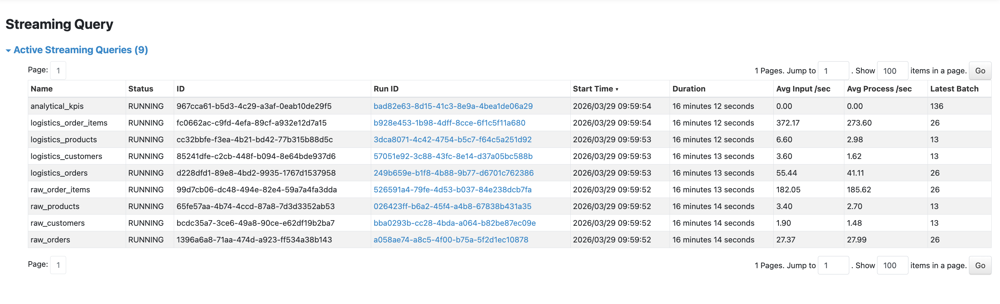

**Spark jobs — 1743 completed**
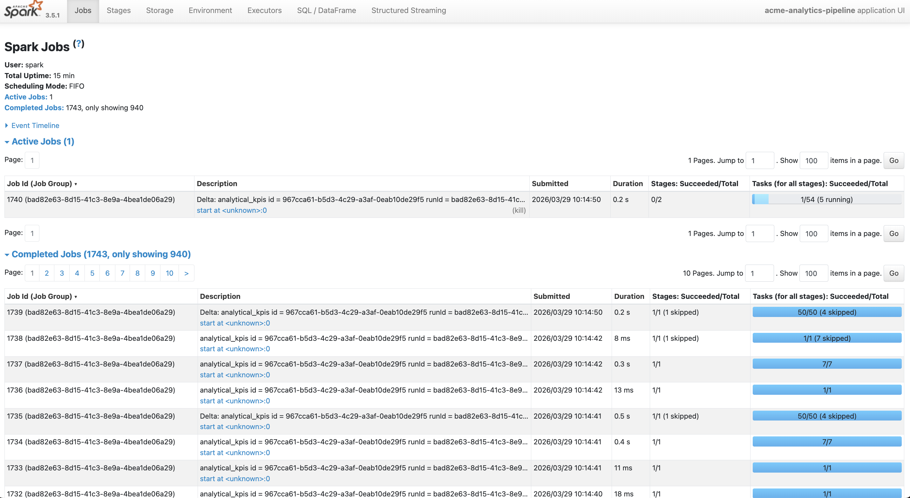

**Spark environment — local[4], 2g driver**
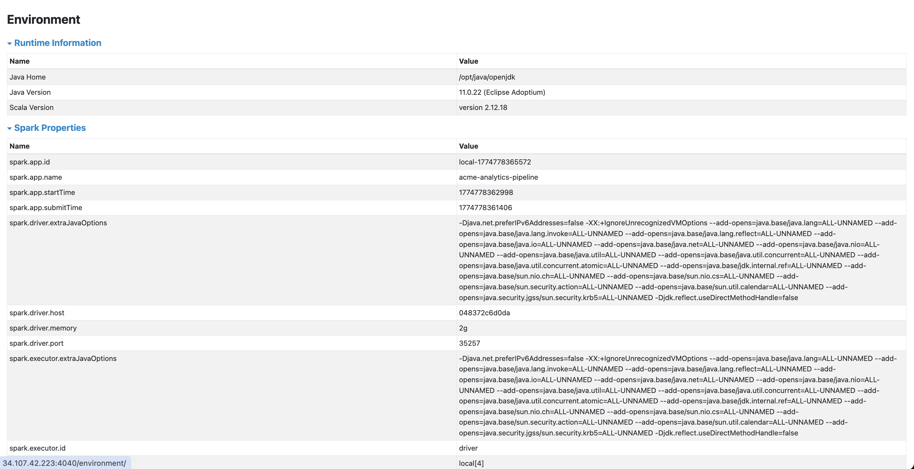

**Raw Delta tables**
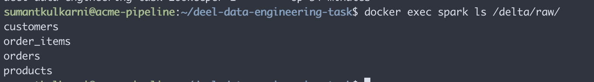

**Logistics Delta tables**
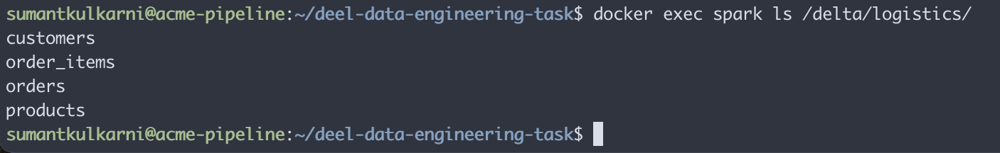

**Logistics orders table — schema and data**
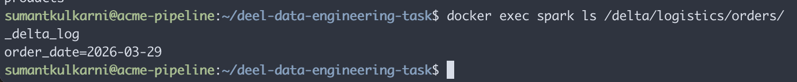

**Kafka lag — avgOffsetsBehindLatest: 0.0**
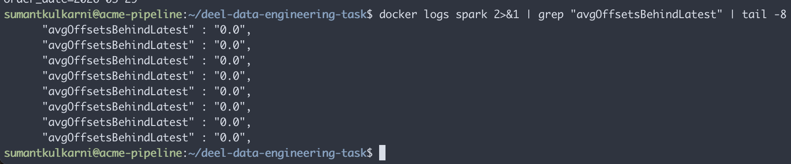

**Gold writing open_orders — rows and elapsed ms**
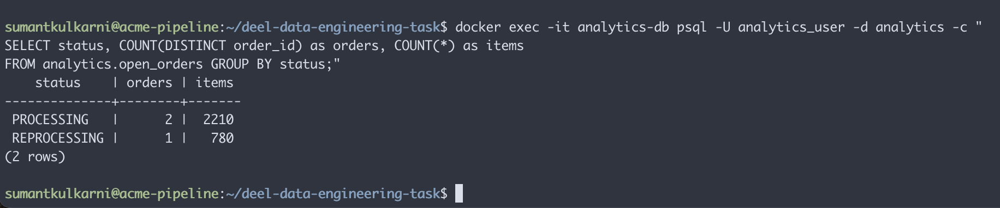

**Gold pipeline logs**
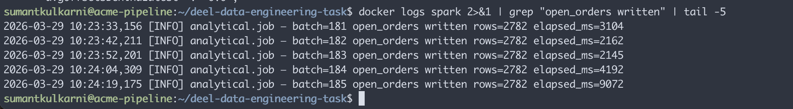

**Docker — all containers running**
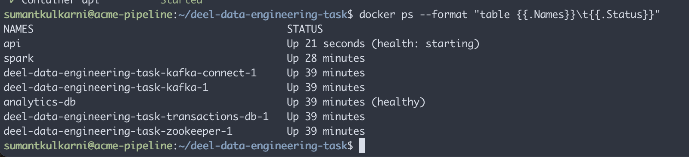

**API — /kpis/open-orders**
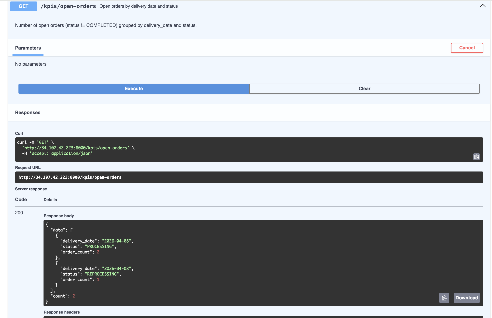

**API — /kpis/top-delivery-dates**
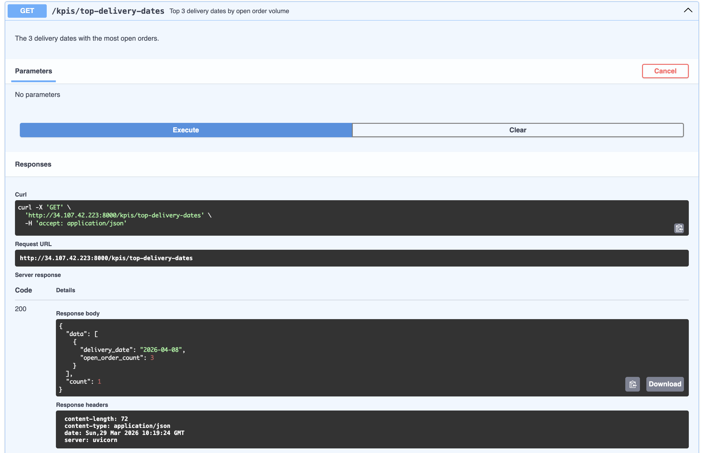

**API — /kpis/pending-items-by-product**
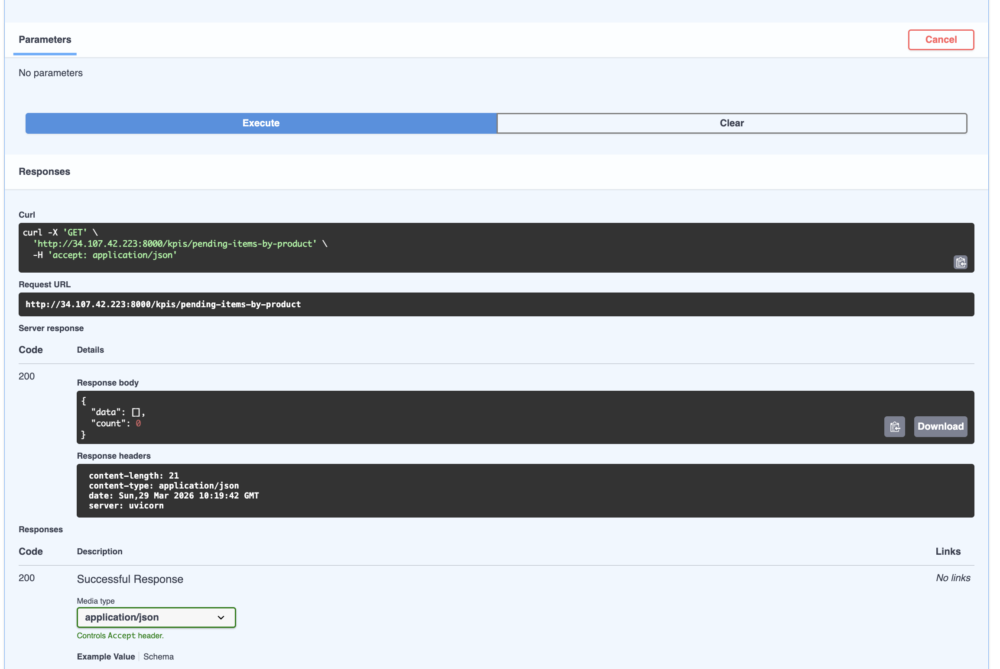

**API — /kpis/top-customers-pending**
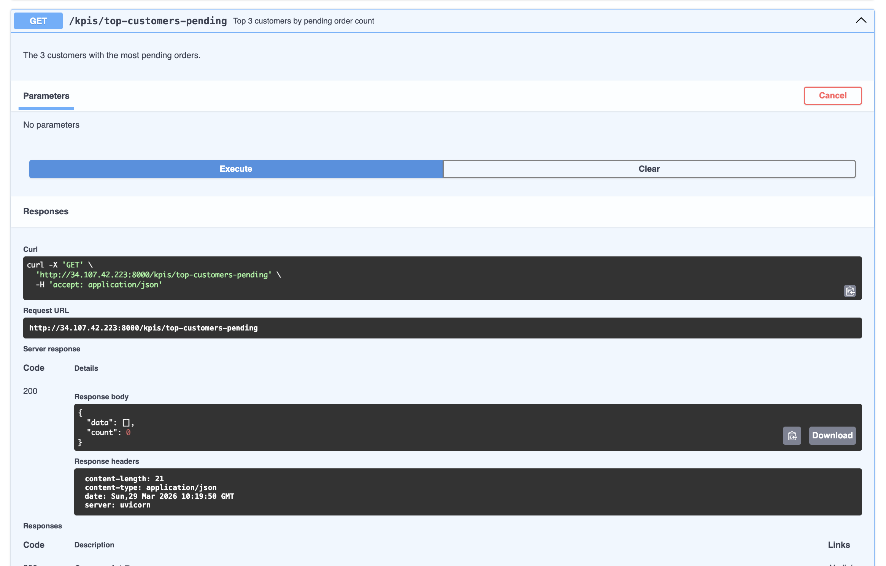

